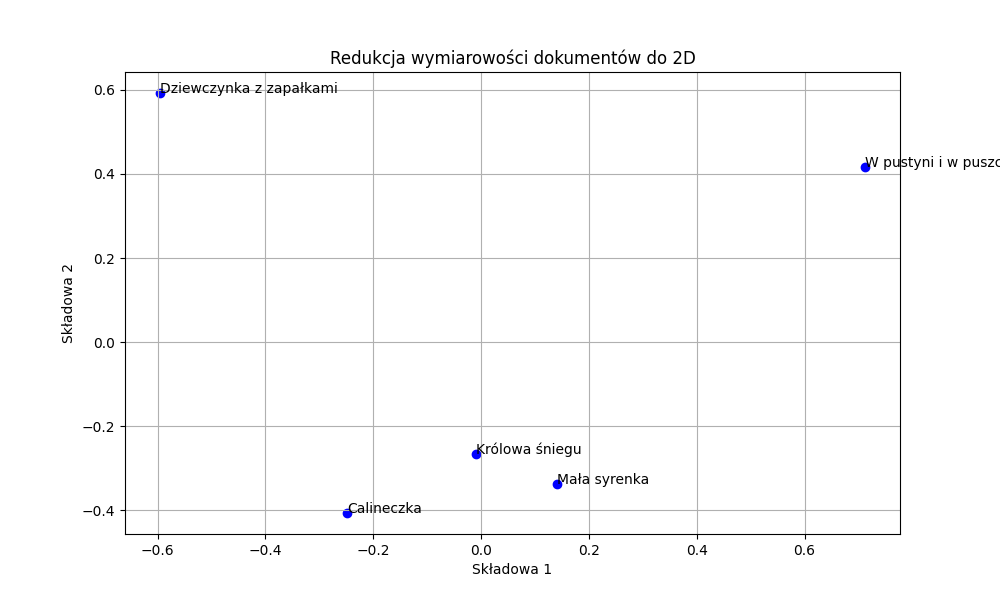

## Wykresy częstotliwości i Prawo Zipfa

### Calineczka
| Częstości                                               | Prawo Zipfa |
|---------------------------------------------------------|-------------|
|  |  |

### Dziewczynka z zapałkami
| Częstości | Prawo Zipfa |
|-----------|-------------|
|  |  |

### Królowa Śniegu
| Częstości | Prawo Zipfa |
|-----------|-------------|
|  |  |

### Mała Syrenka
| Częstości | Prawo Zipfa |
|-----------|-------------|
|  |  |

## Wnioski

- **Prawo Zipfa nie zostało zachowane**. W przypadku gdyby zostało zachowane wykres byłby zbliżony do wyrysowanych linii prostych (wykres jest logarytmiczny).

# Analiza Macierzy Podobieństwa i Redukcji Wymiarowości TF-IDF

## Macierz Podobieństwa Kosinusowego

Macierz przedstawia podobieństwo kosinusowe między pięcioma dokumentami:

| Dokument                    | Mała Syrenka | Calineczka | Dziewczynka z Zapałkami | Królowa Śniegu | W Pustyni i w Puszczy |
|-----------------------------|--------------|------------|-------------------------|----------------|-----------------------|
| **Mała Syrenka**            | 1.0000       | 0.1489     | 0.1137                  |0.1621| 0.1304                |
| **Calineczka**              | 0.1489       | 1.0000     | 0.1326                  | 0.1571         | 0.0966                |
| **Dziewczynka z Zapałkami** | 0.1137       | 0.1326     | 1.0000                  | 0.1286         | 0.0668                |
| **Królowa Śniegu**          | 0.1621       | 0.1571     | 0.1286                  | 1.0000         | 0.1237                |
| **W Pustyni i w Puszczy**   | 0.1304       | 0.0966     | 0.0668                  | 0.1237         | 1.0000                |

## Redukcja Wymiarowości TF-IDF

Wyniki analizy redukcji wymiarowości TF-IDF do dwóch wymiarów za pomocą PCA:

| Dokument                    | X       | Y       |
|-----------------------------|---------|---------|
| **Mała Syrenka**            | 0.1408  | -0.3381 |
| **Calineczka**              | -0.2477 | -0.4062 |
| **Dziewczynka z Zapałkami** | -0.5950 | 0.5923  |
| **Królowa Śniegu**          | -0.0097 | -0.2651 |
| **W Pustyni i w Puszczy**   | 0.7117  | 0.4171  |

## Wnioski

- **Najbardziej podobne dokumenty** na podstawie podobieństwa kosinusowego to:
  - *Mała Syrenka* i *Królowa Śniegu* (0.1621)
  - *Calineczka* i *Królowa Śniegu* (0.1571)
  
- **W redukcji wymiarowości** za pomocą PCA:
  - Dokumenty blisko siebie w przestrzeni 2D to *Mała Syrenka* i *Królowa Śniegu*.
  - Dokumenty *W Pustyni i w Puszczy* oraz *Dziewczynka z Zapałkami* są najbardziej oddalone.
  - Da się zauważyć duże podobieństwo dla *Calineczki*, *Królowej Śniegu* i *Małej Syrenki*, natomiast *Dziewczynka z zapałkami* i *W Pustyni i w Puszczy* są bardzo oddalone od pozostałych książek.